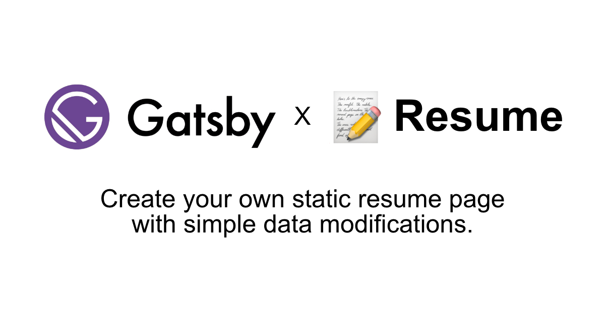

# Static Website Resume with GatsbyJS



> 데이터 파일만 수정해 자신만의 정적 웹사이트 이력서를 만들어보세요.

<div align="center" id="badge">

    <br/>
  <br/>
   

</div>

## Demo

- [Demo URL](https://alstn2468.github.io/Gatsby_Resume/)

<details>
  <summary>Use case</summary>
  <p>
    <ul>
      <li>alstn2468: https://alstn2468.github.io/gatsby-resume/</li>
      <li>bugoverdose: https://bugoverdose.github.io/resume/</li>
    </ul>
  </p>
</details>

> 이 템플릿을 사용하고 계시다면 `Use case`를 추가해 Pull Request를 남겨주세요!

## 🚚 프로젝트 시작하기

### 1. 프로젝트 생성하기

```bash
npx gatsby new <생성되는 프로젝트 이름> https://github.com/alstn2468/gatsby-resume
```

> `npx`를 사용하지 않으면 [Gatsby Getting Started](https://www.gatsbyjs.org/docs/quick-start)를 따라해주세요.

```bash
npm install -g gatsby-cli
gatsby new <생성되는 프로젝트 이름> https://github.com/alstn2468/gatsby-resume
```

### 2. 의존성 설치

이 프로젝트는 의존성 관리를 위하여 패키지 매니저 [pnpm](https://pnpm.js.org/)을 사용합니다.

package-lock.json 파일이 생성된 경우 삭제해야 합니다.

> `npx`를 이용해 프로젝트를 생성했다면 `install` 명령어는 실행하지 않아도 됩니다.

```bash
cd <생성되는 프로젝트 이름>
npm install -g pnpm
pnpm install
```

> 프로젝트 폴더 내부에서 `install` 명령어를 실행해야 합니다.

pnpm을 설치하는 다른 방법은 [pnpm 문서](https://pnpm.js.org/en/installation)를 참고해주세요.

### 3. 프로젝트 실행하기

- `.env` 파일 설정하기

`.env.example` 파일을 복사해 각자의 설정에 맞추어 수정합니다.<br/>
또한 `.github/workflows/deploy-gh-pages.yml` 파일을 열어 50, 51, 62, 63번 줄을 수정합니다.

```env
PUBLIC_URL="https://<GITHUB_ID>.github.io/<REPOSITORY_NAME>/"
GATSBY_PATH_PREFIX="/<REPOSITORY_NAME>"
GATSBY_STRICT_L10N="<Boolean>"
```

- `develop` 명령어 실행하기

> 프로젝트 폴더 내부에서 명령어를 실행해야합니다.

```bash
pnpm develop
# localhost:8000에서 확인할 수 있습니다.
```

### 4. Git 레파지토리 생성 및 연결하기

명령어를 이용해 Git 연결을 진행하기 전 Github에서 새로운 레파지토리를 생성해야합니다.

> 프로젝트 폴더 내부에서 명령어를 실행해야합니다.

```bash
git init -b main
git add --all
git commit -m "Some commit comment."
git remote add origin https://github.com/<username>/<respository_name>
git push -u origin main
```

### 5. Github Action 배포 자동화 설정

> 이 프로젝트는 Github Action을 이용한 배포 자동화를 지원합니다.

1. [Personal access tokens](https://github.com/settings/tokens) 페이지에서 새로운 토큰을 발급 받아 복사합니다.
2. 자신의 프로젝트 Repository의 Settings탭의 Secrets에 들어갑니다.
3. `ACCESS_TOKEN`이라는 이름으로 새로운 secret을 생성하고 복사한 토큰을 붙여넣습니다.

이로써 기본적인 프로젝트 설정은 마쳤습니다.<br/>
변경사항을 커밋한 후 `main` 브랜치에 푸시가 되면 자동적으로 배포가 진행됩니다.<br/>
배포된 웹사이트는 `https://<username>.github.io/<repository name>`에서 확인할 수 있습니다.<br/>
README 상단의 [뱃지](#badge)의 주소들을 변경해 뱃지도 관리해보세요.

## 🚀 데이터 설정 및 배포하기

이 프로젝트의 데이터는 `package.json` 파일이 있는 경로의 `data` 폴더 내부에 존재합니다.

기본적으로 한국어(`ko.yml`)과 영어(`en.yml`)를 지원하며 다른 언어를 추가할 수도 있습니다.

언어 코드는 [ISO 630-1](https://www.w3schools.com/tags/ref_language_codes.asp)를 따릅니다.

`gatsby-node.ts` 파일의 `sourceNodes` 함수의 `targets` 배열에 언어 값을 추가하면 됩니다.

또한 `gatsby-config.ts` 파일의 `gatsby-plugin-manifest` 플러그인의 `localize`속성에 데이터를 추가합니다.

데이터에서 배열 형태로 되어있는 `experience`의 `data`와 같은 항목은 빈 배열일 경우 화면에 그려지지 않습니다.

값이 비어있을 수 없는 데이터인 경우 실행 중 오류가 발생하니 참고해 설정해야 합니다.

`translations` 목록의 하위 아이템들은 프로젝트에 사용되는 번역 대상 데이터입니다.

해당 데이터를 다른 텍스트로 변경하시고 싶으실 경우 변경하셔도 무방합니다.

`translations` 목록으로 생성된 번역 텍스트는 `l10nContext.ts`에 있는 `useTranslation` 함수를 이용해 사용할 수 있습니다.

모든 데이터 설정이 완료되면 [프로젝트 시작하기](#-프로젝트-시작하기) 과정을 통해 적용된 값을 확인해 Github Repository에 Push하면 됩니다.

## 🙏 기여

여러분들의 코드 작성, 오탈자 수정 등 모든 기여는 감사합니다.

1. 기여할 내용에 대한 [이슈를 작성](https://github.com/alstn2468/gatsby-resume/issues/new)해주세요.
2. 이 프로젝트를 Fork 해주세요.
3. 작업을 진행할 branch를 만들어주세요. (git checkout -b somefeature)
4. 작업을 진행한 후 Commit을 해주세요. (git commit -m 'Add some feature')
5. 작업한 branch에 Push를 해주세요. (git push origin somefeature)
6. Pull Request를 생성해주세요.

프로젝트가 도움이 된다면 ⭐ 을 눌러주세요.

## 📝 To do

- [x] GatsbyJs + TypeScript 세팅
- [x] CI/CD 파이프라인 구성 (배포는 gh-pages)
- [x] 데이터 구조 설계
- [x] yml을 이용한 국문+영문 데이터 소싱
- [x] 반응형 페이지 레이아웃 디자인
- [x] 컴포넌트 개발
- [x] 페이지 개발
- [ ] pdf export 기능
- [x] 문서 작성
- [ ] 테스트 코드 작성

<div align="center">

<sub><sup>Written by <a href="https://github.com/alstn2468">@Minsu Kim</a></sup></sub><small>✌</small>

</div>
